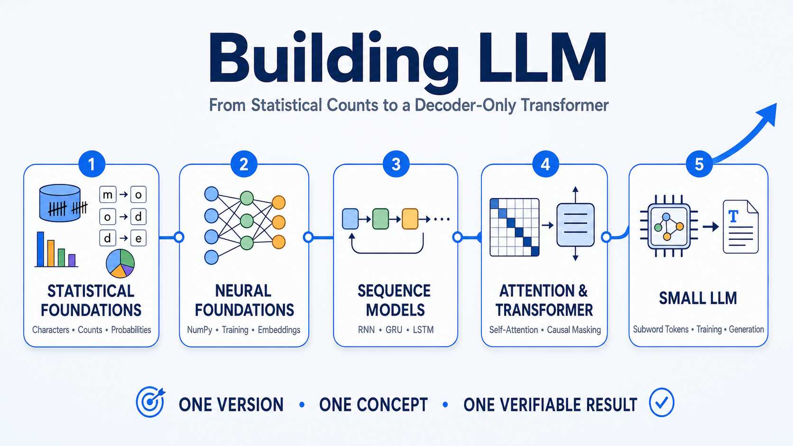

# Building LLM


[](LICENSE)


A progressive educational project that shows how language models are built step by step, from a simple character-level statistical model to a small decoder-only Transformer.

The project begins with standard Python and introduces one new concept in each version. The goal is not to compete with industrial models, but to make tokenization, probability, training, neural networks, attention and autoregressive generation easier to understand.

## Project roadmap

The complete project evolves through five main stages:

1. statistical foundations;
2. neural foundations;
3. sequence models;
4. attention and Transformer architecture;
5. a small decoder-only language model.

Each stage introduces the concepts required by the next one while keeping the implementation understandable and verifiable.



## Current version

Version 1 implements a character-level statistical language model using only Python's standard library.

The model:

- reads a small English training corpus;
- builds a character vocabulary;
- creates adjacent-character training examples;
- counts character transitions;
- converts the counts into probability distributions;
- samples one character at a time;
- generates text reproducibly using a local random seed.

The first versions are language models, but they are not yet large language models. The LLM label becomes appropriate later in the project, after the introduction of subword tokenization, a decoder-only Transformer, a meaningful parameter count and training on a substantial corpus.

## Current architecture

```text
English Training Text
          ↓
Adjacent Character Pairs
          ↓
Transition Counts
          ↓
Probability Distributions
          ↓
Next-Character Sampling
          ↓
Generated Text
```

The model uses one character as context. The newly generated character becomes the context for the next prediction.

## Version 1 - Character Statistical Model

For every character in the corpus, the model counts which characters appeared immediately after it.

For example:

```text
m → o
m → a
m → e
```

The transition counts are normalized into probabilities:

```text
P(next | current) = count(current → next) / total counts(current)
```

Generation is autoregressive:

1. read the current character;
2. sample the next character;
3. append it to the output;
4. use the sampled character as the new context;
5. repeat.

The random generator uses a local seed, making the example reproducible without modifying Python's global random state.

### Version 1 architecture


Open the folder:

[`v01-character-model`](v01-character-model/)

## Project versions

| Version | Main concept | Status |
|---|---|---|
| Version 1 | Character statistical model | Completed |
| Version 2 | Small neural network with NumPy | Planned |
| Version 3 | Training foundations | Planned |
| Version 4 | TensorFlow introduction | Planned |
| Version 5 | Embeddings and context windows | Planned |
| Version 6 | Recurrent language model | Planned |
| Version 7 | GRU or LSTM model | Planned |
| Version 8 | Attention | Planned |
| Version 9 | Transformer block | Planned |
| Version 10 | Mini decoder-only language model | Planned |
| Version 11 | Subword tokenizer and public datasets | Planned |
| Version 12 | Kaggle training pipeline | Planned |
| Version 13 | Evaluation and controlled generation | Planned |
| Version 14 | Instruction tuning | Planned |
| Version 15 | Advanced small LLM | Planned |

## Included checks

The Version 1 notebook verifies:

- the correct number of adjacent-character examples;
- that next-character probabilities sum to 1;
- reproducible generation with the same seed;
- the requested output length.

The notebook can be executed from top to bottom without a GPU or external packages.

## Documentation

The repository includes a complete general project report in Italian and English:

- [Project report - English](project-report-en.pdf)
- [Relazione del progetto - Italiano](project-report-it.pdf)

Each completed version folder contains:

- a Jupyter Notebook;
- an Italian technical report;
- an English technical report;
- an architecture diagram.

## Repository structure

```text
building-llm/
├── v01-character-model/
│   ├── building-llm.ipynb
│   ├── Relazione Versione 1 - Modello Statistico a Caratteri.pdf
│   ├── Report Version 1 - Character Statistical Model.pdf
│   └── Version 1.png
│
├── project-report-en.pdf
├── project-report-it.pdf
├── README.md
├── LICENSE
└── .gitignore
```

## Run locally

### Requirements

- Python 3
- Jupyter Notebook or JupyterLab

Version 1 uses only Python's standard library. No machine-learning framework is required.

Clone the repository:

```bash
git clone https://github.com/lucalullo/building-llm.git
cd building-llm
```

Start Jupyter Notebook:

```bash
jupyter notebook
```

Then open:

```text
v01-character-model/building-llm.ipynb
```

Run the cells in order.

## Development approach

The project follows one main principle:

> **One version, one concept, one verifiable result.**

Instead of starting with a complex Transformer, the project introduces each mechanism through small and understandable steps.

Every completed version remains available as an independent learning resource.

## Roadmap

- [x] Character statistical language model
- [ ] Small neural language model with NumPy
- [ ] Training objective, optimization and data splits
- [ ] TensorFlow and automatic differentiation
- [ ] Embeddings and larger context windows
- [ ] Recurrent neural networks
- [ ] GRU or LSTM
- [ ] Scaled dot-product attention
- [ ] Transformer block
- [ ] Decoder-only Transformer
- [ ] Subword tokenization and public datasets
- [ ] Kaggle training pipeline and checkpoints
- [ ] Evaluation and controlled generation
- [ ] Instruction tuning
- [ ] Reproducible advanced small LLM

## Current limitations

Version 1 is intentionally simple:

- the context contains only one character;
- the training corpus is small and embedded in the notebook;
- unseen transitions have zero probability;
- the model has no trainable neural parameters;
- it does not understand words, grammar or meaning;
- generation quality depends entirely on the observed transition counts.

These limitations define the starting point for the following versions.

## License

This project is distributed under the [MIT License](LICENSE).

## Author

Created by [Luca Lullo](https://github.com/lucalullo).
